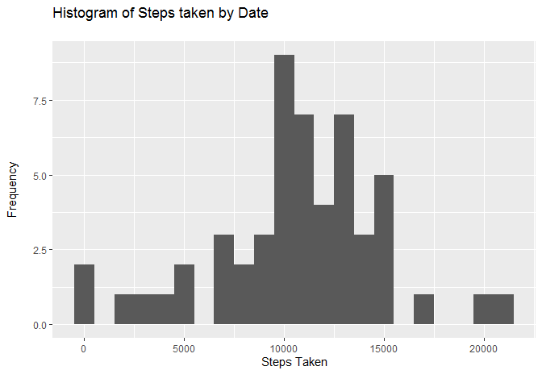

```r
library(tidyverse)
library(readxl)
library(ggplot2)
```

## Loading and preprocessing the data

Load the data

```r
unzip("repdata_data_activity.zip")
activity <- read_csv("activity.csv")
```

Process/transform the data (if necessary) into a format suitable for your analysis

```r
str(activity)
```

```
## Classes 'spec_tbl_df', 'tbl_df', 'tbl' and 'data.frame':	17568 obs. of  3 variables:
##  $ steps   : num  NA NA NA NA NA NA NA NA NA NA ...
##  $ date    : Date, format: "2012-10-01" "2012-10-01" ...
##  $ interval: num  0 5 10 15 20 25 30 35 40 45 ...
##  - attr(*, "spec")=
##   .. cols(
##   ..   steps = col_double(),
##   ..   date = col_date(format = ""),
##   ..   interval = col_double()
##   .. )
```
- using read_csv from the `tidyverse` package automatically converts the date column to a date format.

## What is mean total number of steps taken per day?

Calculate the total number of steps taken per day

```r
step_count <- activity %>%
        group_by(date) %>%
        summarise(total_step_count = sum(steps))
step_count
```

```
## # A tibble: 61 x 2
##    date       total_step_count
##    <date>                <dbl>
##  1 2012-10-01               NA
##  2 2012-10-02              126
##  3 2012-10-03            11352
##  4 2012-10-04            12116
##  5 2012-10-05            13294
##  6 2012-10-06            15420
##  7 2012-10-07            11015
##  8 2012-10-08               NA
##  9 2012-10-09            12811
## 10 2012-10-10             9900
## # ... with 51 more rows
```

If you do not understand the difference between a histogram and a barplot, research the difference between them. Make a histogram of the total number of steps taken each day

```r
ggplot(step_count) +
        aes(x = total_step_count) +
        geom_histogram(binwidth = 1000) +
        labs(
                title = "Histogram of Steps taken by Date\n",
                x = "Steps Taken\n",
                y = "Frequency\n"
        )
```

```
## Warning: Removed 8 rows containing non-finite values (stat_bin).
```

<!-- -->

Calculate and report the mean and median of the total number of steps taken per day

```r
summary(step_count$total_step_count)
```

```
##    Min. 1st Qu.  Median    Mean 3rd Qu.    Max.    NA's 
##      41    8841   10765   10766   13294   21194       8
```

## What is the average daily activity pattern?

Make a time series plot of the 5-minute interval (x-axis) and the average number of steps taken, averaged across all days (y-axis)

```r
ave_steps <- activity %>%
        group_by(interval) %>%
        summarise(average_step_count = mean(steps, na.rm = TRUE))

ggplot(ave_steps) +
        aes(x = interval, y = average_step_count) +
        geom_line() +
        labs(
                title = "Average number of steps taken per 5 minute period\n",
                x = "\nInterval",
                y = "Average Step Count\n"
        )
```

<!-- -->

Which 5-minute interval, on average across all the days in the dataset, contains the maximum number of steps?

```r
ave_steps["average_step_count" == max("average_step_count"), ]
```

```
## # A tibble: 288 x 2
##    interval average_step_count
##       <dbl>              <dbl>
##  1        0             1.72  
##  2        5             0.340 
##  3       10             0.132 
##  4       15             0.151 
##  5       20             0.0755
##  6       25             2.09  
##  7       30             0.528 
##  8       35             0.868 
##  9       40             0     
## 10       45             1.47  
## # ... with 278 more rows
```

## Imputing missing values

Note that there are a number of days/intervals where there are missing values. The presence of missing days may introduce bias into some calculations or summaries of the data.

Calculate and report the total number of missing values in the dataset.

```r
sum(is.na(activity$steps))
```

```
## [1] 2304
```

Devise a strategy for filling in all of the missing values in the dataset. The strategy does not need to be sophisticated. For example, you could use the mean/median for that day, or the mean for that 5-minute interval.

Create a new dataset that is equal to the original dataset but with the missing data filled in.

```r
activity_impute <- split(activity, activity$interval)

for(index in 1:length(activity_impute)) {
        activity_impute[[index]]$steps[is.na(activity_impute[[index]]$steps)] <-
                mean(activity_impute[[index]]$steps, na.rm = TRUE)
}

activity_impute <- do.call("rbind", activity_impute)

row.names(activity_impute) <- NULL
```

Make a histogram of the total number of steps taken each day and Calculate and report the mean and median total number of steps taken per day. 

```r
step_count_impute <- activity_impute %>%
        group_by(date) %>%
        summarise(total_step_count = sum(steps))

ggplot(step_count_impute) +
        aes(x = total_step_count) +
        geom_histogram(binwidth = 1000) +
        labs(
                title = "Histogram of Steps taken by Date (Imputed Data)\n",
                x = "Steps Taken\n",
                y = "Frequency\n"
        )
```

<!-- -->

```r
summary(step_count_impute$total_step_count)
```

```
##    Min. 1st Qu.  Median    Mean 3rd Qu.    Max. 
##      41    9819   10766   10766   12811   21194
```

Do these values differ from the estimates from the first part of the assignment? What is the impact of imputing missing data on the estimates of the total daily number of steps?

- Imputing the data by using the mean of the interval doesn't change the frequency distribution of the histogram which is to be expected as we're using the mean values within each interval. The total number of steps increases since we're now including another 8 days worth of values. 
- The minimum, maximum, mean and mdian values for step count all remain the same, the 1st quartile is now higher and the 3rd quartile is now lower.

## Are there differences in activity patterns between weekdays and weekends?

For this part the weekdays() function may be of some help here. Use the dataset with the filled-in missing values for this part.

Create a new factor variable in the dataset with two levels – “weekday” and “weekend” indicating whether a given date is a weekday or weekend day.

```r
activity_impute <- activity_impute %>%
        mutate(day = weekdays(activity_impute$date)) %>%
        mutate(day_type = ifelse(day == "Saturday" | day == "Sunday", "Weekend", "Weekday")) %>%
        mutate(day_type = as.factor(day_type))
```

Make a panel plot containing a time series plot of the 5-minute interval (x-axis) and the average number of steps taken, averaged across all weekday days or weekend days (y-axis).

```r
ave_steps_impute <- activity_impute %>%
        group_by(interval, day_type) %>%
        summarise(average_step_count = mean(steps, na.rm = TRUE))

ggplot(ave_steps_impute) +
        aes(x = interval, y = average_step_count) +
        geom_line() +
        labs(
                title = "Average number of steps taken per 5 minute period\n",
                x = "\nInterval",
                y = "Average Step Count\n"
        ) +
        facet_wrap( ~ day_type)
```

<!-- -->
